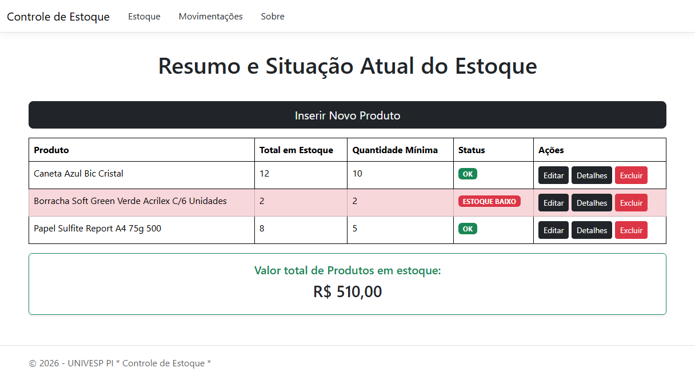
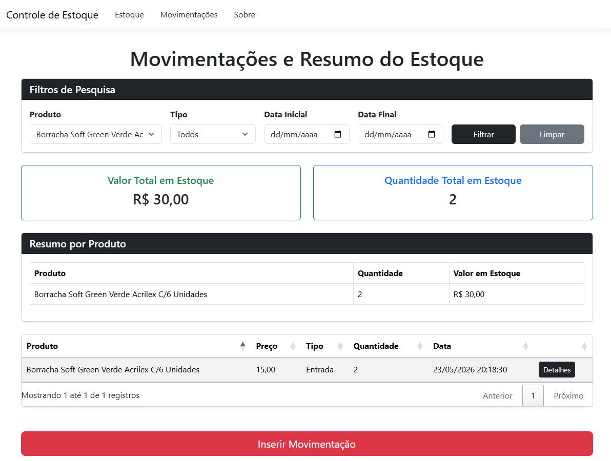

# UNIVESP - Projeto Integrador 1 - Sistema Genérico de Gestão de Estoque

## Projeto ASP.NET Core MVC

Este é um projeto desenvolvido com o objetivo de demonstrar a implementação de uma aplicação web, utilizando o padrão MVC (Model-View-Controller) e algumas práticas de desenvolvimento com a plataforma .NET.

Desenvolvido por alunos da Univesp. 

### Tecnologias Utilizadas:

* Linguagem: C#
* Framework Web: ASP.NET Core MVC
* Framework ORM - Mapeador Objeto-Relacional: Entity Framework Core
* Abordagem de Banco de Dados: Code First (Migrações automáticas)
* Banco de Dados: SQL Server (LocalDB)
* Interface (Front-end): Razor Pages & Bootstrap
* Interatividade: jQuery & DataTables (para listagens dinâmicas e otimizadas)

### Funcionalidades

* CRUD completo de Produtos
* Interface responsiva e amigável.
* Listagem com busca, ordenação e paginação via DataTables 

## Telas Principais do Sistema:

